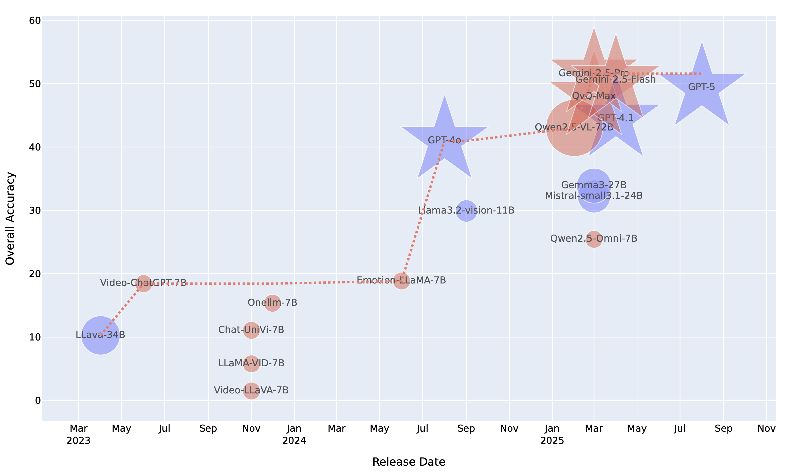
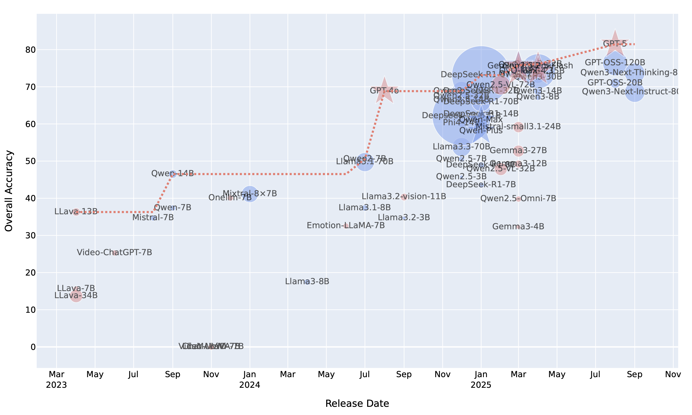
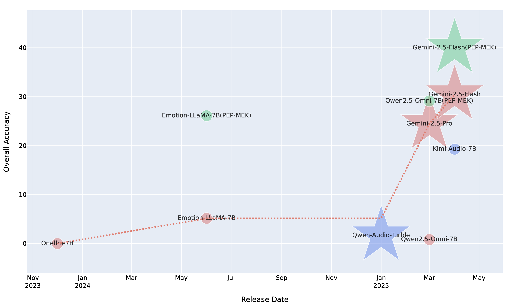

# EmotionHallucer: Evaluating Emotion Hallucinations in Multimodal Large Language Models 

## 📰 News

- **[2025-05]**: [Project page](https://github.com/emo-pupu/EmotionHallucer) released.
- **[2025-05]**: [Paper](https://arxiv.org/abs/2505.11405) released.

## 🔧 TODO

- Benchmark data release (in progress).

## ✏️ Abstract

Emotion understanding is a critical yet challenging task. 
Recent advances in Multimodal Large Language Models (MLLMs) have significantly enhanced their capabilities in this area. 
However, MLLMs often suffer from hallucinations, generating irrelevant or nonsensical content.
To the best of our knowledge, despite the importance of this issue, there has been no dedicated effort to evaluate emotion-related hallucinations in MLLMs.
In this work, we introduce *EmotionHallucer*, the first benchmark for detecting and analyzing emotion hallucinations in MLLMs. 
Unlike humans, whose emotion understanding stems from the interplay of biology and social learning, MLLMs rely solely on data-driven learning and lack innate emotional instincts. Fortunately, emotion psychology provides a solid foundation of knowledge about human emotions.
Building on this, we assess emotion hallucinations from two dimensions: emotion psychology knowledge and real-world multimodal perception. 
To support robust evaluation, we utilize an adversarial binary question–answer (QA) framework, which employs carefully crafted basic and hallucinated pairs to assess the emotion hallucination tendencies of MLLMs.
By evaluating 38 LLMs and MLLMs on EmotionHallucer, we reveal that:
i) most current models exhibit substantial issues with emotion hallucinations;
ii) closed-source models outperform open-source ones in detecting emotion hallucinations, and reasoning capability provides additional advantages;
iii) existing models perform better in emotion psychology knowledge than in multimodal emotion perception.
As a byproduct, these findings inspire us to propose the *PEP-MEK* framework, which yields an average improvement of 9.90\% in emotion hallucination detection across selected models.

## 📊 Benchmark Examples and Statistics

### WordCloud

### Data Statistics

| **Statistic**                | **Count**         |
|-----------------------------|-------------------|
| Questions                   | 2,742             |
| Images                      | 150               |
| Audios                      | 368               |
| Videos                      | 230               |
| Avg Question len            | 31.6              |
| Avg Knowledge Text len      | 19.9              |
| Avg Review Text len         | 108.7             |
| Avg Image resolution        | 579.5 × 466.5     |
| Avg Audio len               | 4.2               |
| Avg Short Video len         | 4.3               |
| Avg Short Video resolution  | 870.0 × 476.9     |
| Avg Long Video len          | 60.0              |
| Avg Long Video resolution   | 637.9 × 360.0     |

### Examples

## 📈 Benchmark Evaluation

### All Modalities

### With Audio Modality

### Emotion Knowledge

### Perception: Text

### Perception: Image

### Perception: Audio

### Perception: Short Video

### Perception: Long Video

